

 

##  

Matlab Assignment

Analog Communication

Team Members:  

1)Eslam Abdellatif Dyab       18010333

2)Mohamed samir fathy      18011484

3)Laura abdulalim elsayed   18011294

4)Ahmed Mahmoud Fakher El-Deen 18010244

5) Islam Ashraf Muhammed  18010324 

#   
I– DSB Part

### 1)  signal in time and  frequency domain

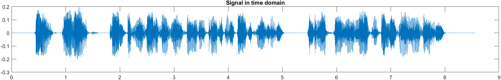

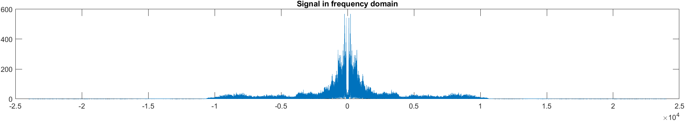

### 2,3) LP Ideal filter at 4 KHz

We can see that the high frequency components were cut off, and only frequency components below 4k passed.

### 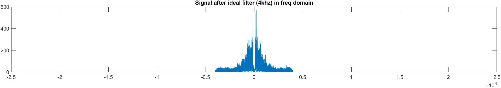 

### 5) Modulated signal

Signal has been shifted to +/- the carrier frequency (100 khz) ,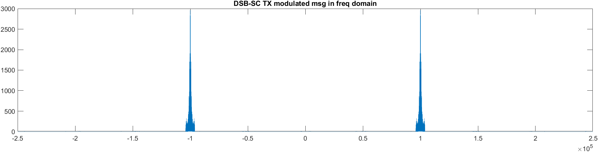

for the DSB-TC we can’t see the signal clearly duo to the high power of the transmitted carrier compared with the signal.

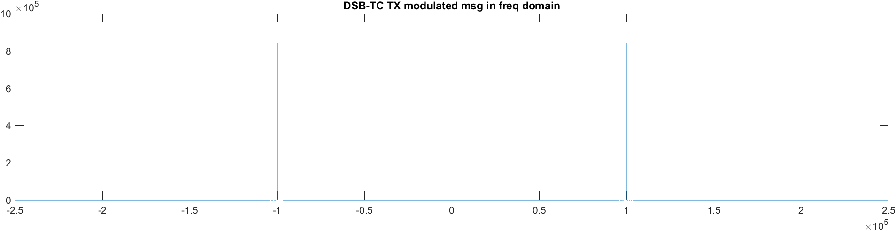

We can see the signal in DSB-TC more clearly if we zoomed in one of the  shifted signals, for example we will zom in the one centered at 100 khz

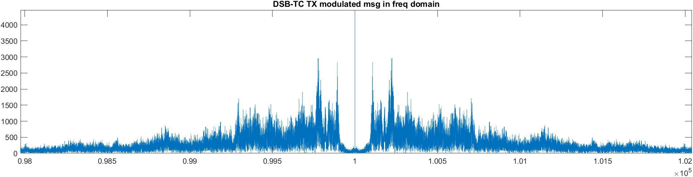

### 6,7) Envelope detector of both DSB-TC and DSB-SC

We can see that the DSP-SC sound signal is distorted, envelope detector can only be used in DSB-TC, as m>1

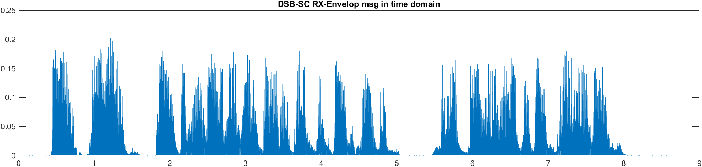

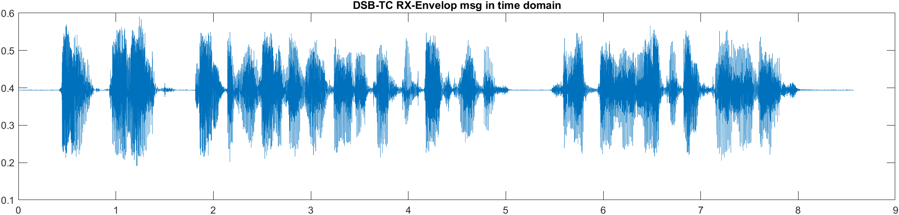

### 

### 

### 

### 

### 

### 

### 

### 

### 8) Coherent detector (changing SNR) of DSB-SC

As a result of multiplying the received signal with the carrier there will be high frequency components at 2fc. So, we put a LPF filter to remove both noise and those high frequency components...

SNR=0, time domain, the signal is clearly so noisy due to the low value of SNR

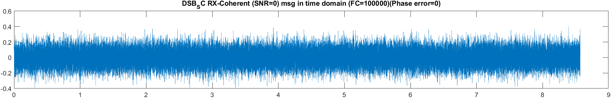

SNR=0, frequency domain, the signal is clearly so noisy due to the low value of SNR, noise power is high too.

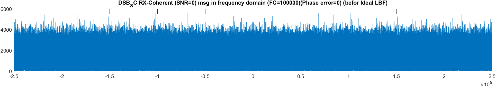

SNR=10, time domain, the signal is still so noisy due to the low value of SNR

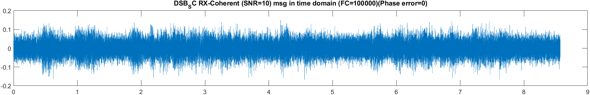

SNR=10, frequency domain, the signal is still so noisy due to the low value of SNR, noise power begins to get lower and the signal begins to appear.

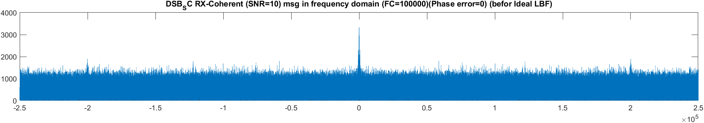

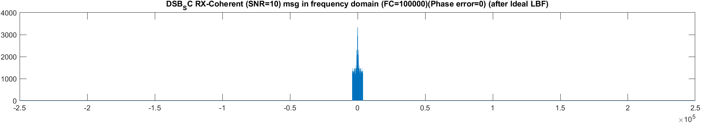

SNR=30, time domain, the signal is now distinguishable due to the high value of SNR

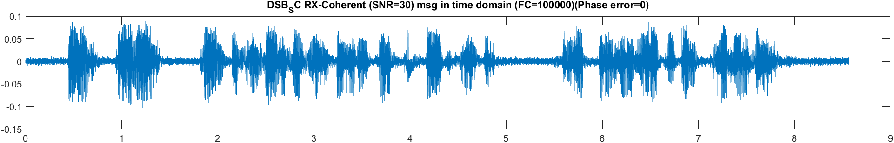

SNR=30, frequency domain, the signal is now distinguishable due to the high value of SNR, noise power is lower, we can see here the two high components signal messages centered at 200/-200 khz

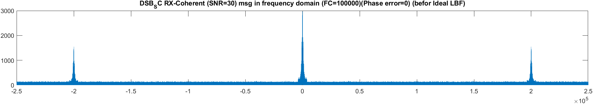

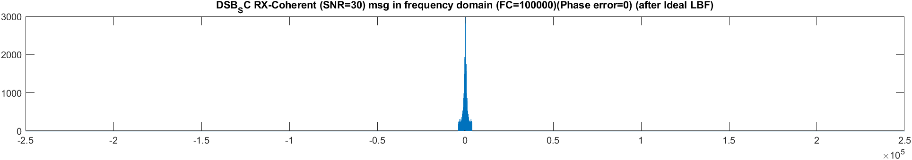

### 

### 

### 

### 

### 

### 

### 

### 

### 

### 

### 9) Coherent detector (Changing SNR and Frequency error) of  DSB-SC

Comments are the same as 8, only difference is the signal will be distorted(beat effect) due to the error in fc.

error = 100.1k - 100k = .1k = 100hz

SNR=0

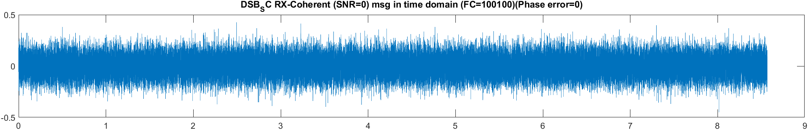

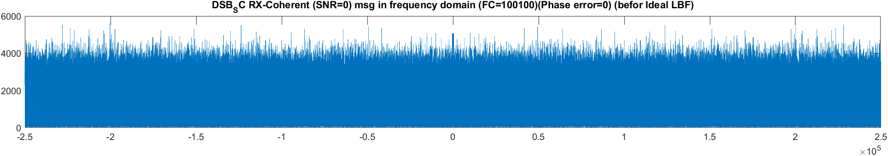

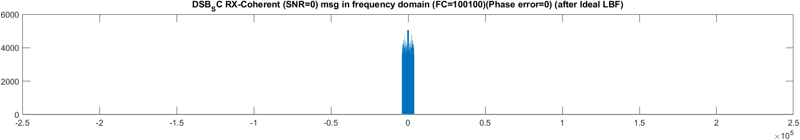

SNR=10

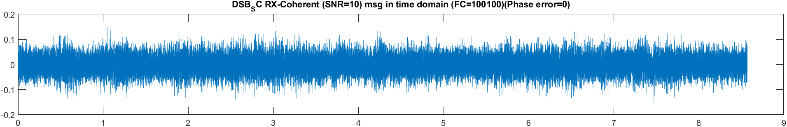

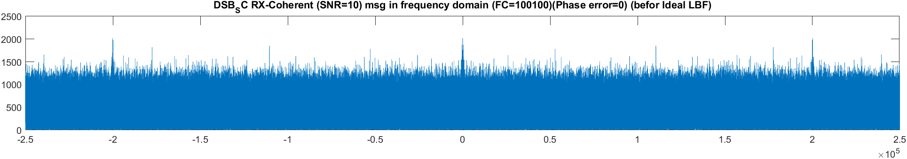

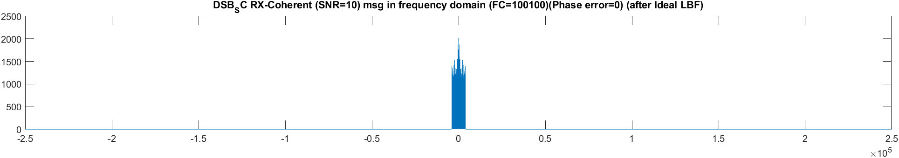

SNR=30

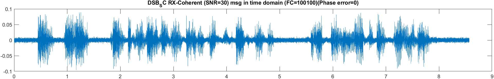

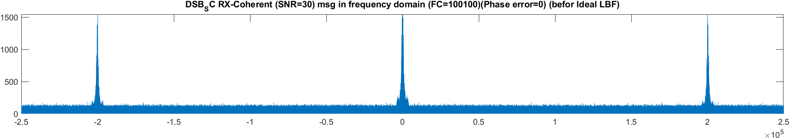

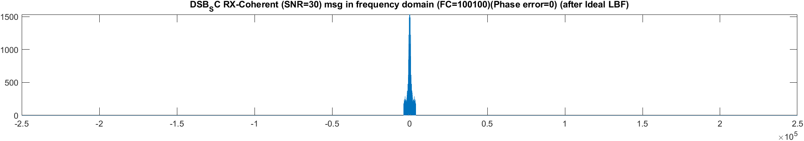

### 

### 10) Coherent detector (Changing SNR and Phase error) of  DSB-SC

Comments are the same as 8, only difference is the signal will be distorted  due to the error in phase.

SNR=0

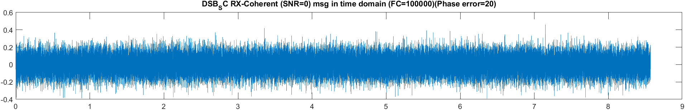

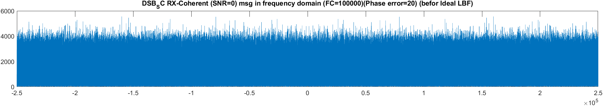

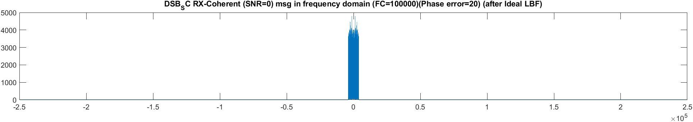

SNR=10

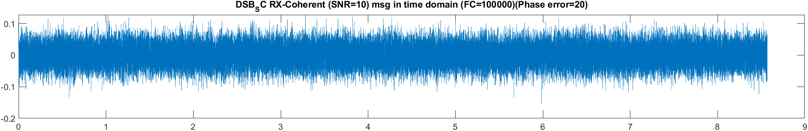

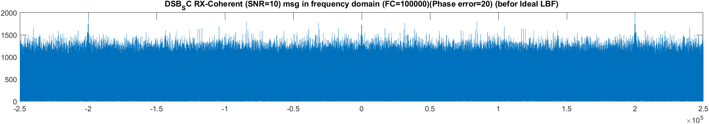

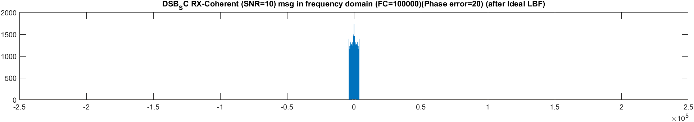

SNR=30

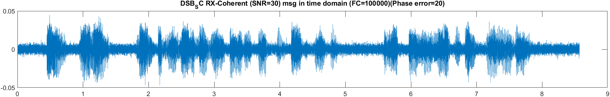

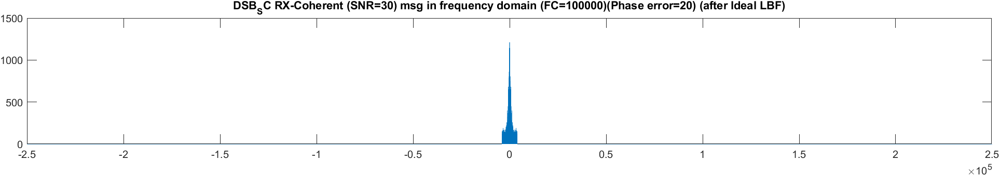

# II– SSB Part

### 1,2,3,4) same as in previous DSB Part 1

### 5) SSB-LSB using ideal filter

We can see that the HSB has been filtered out and only the LSB is obtained, the filter is so precious at fc because here ideal filter is used.

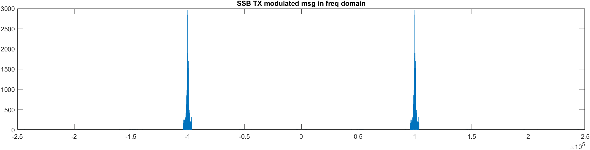

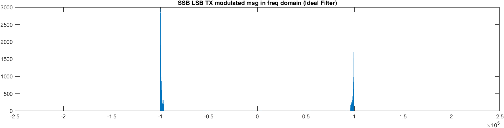

### 

### 

### 

### 

### 

### 

### 

### 

### 6) Coherent detection with no noise

As a result of multiplying the received signal with the carrier there will be high freq components at 2fc. So, we put a LPF filter to remove both noise and those high freq components..

we can see here the two LSB-high components signal messages centered at 200/-200 khz

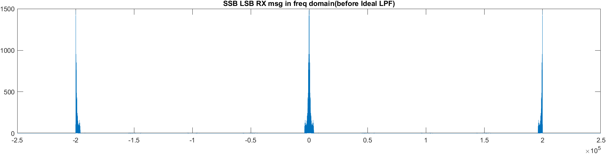

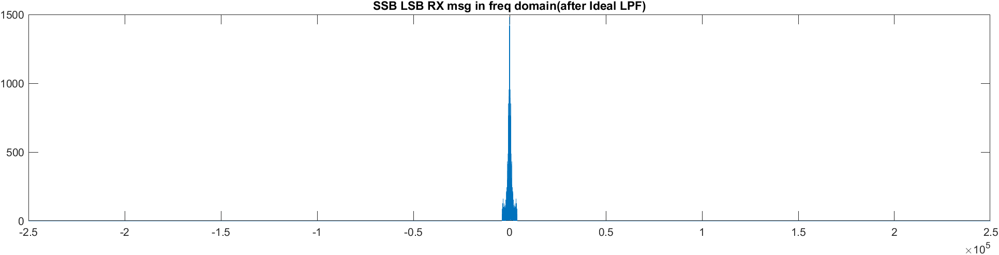

### 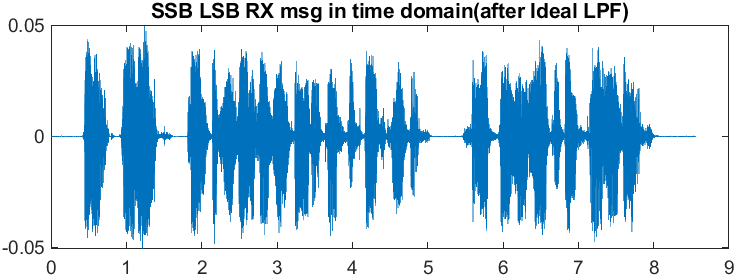

### 

### 

### 

### 7-a) SSB-LSB using butterworth filter

We can see that the HSB has been filtered out and only the LSB is obtained, the filter is not precious at fc because here a butterworth filter is used which is like any other practical filter has a roll-off of some amount.

### 

### 

### 

### 

### 

### 

### 

### 

### 

### 

### 7-b) Coherent detection with no noise (Butterworth filter)

As a result of multiplying the received signal with the carrier there will be high frequency components at 2fc. So, we put a LPF filter to remove both noise and those high frequency components...

we can see here the two LSB-high components signal messages centered at 200/-200 KHz

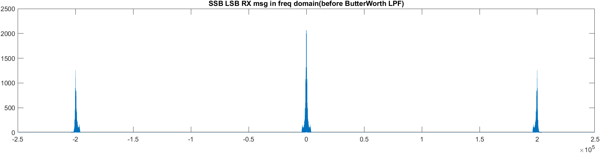

### 

### 8) Coherent detector (changing SNR) of  SSB-SC

SNR=0, signal is so noisy

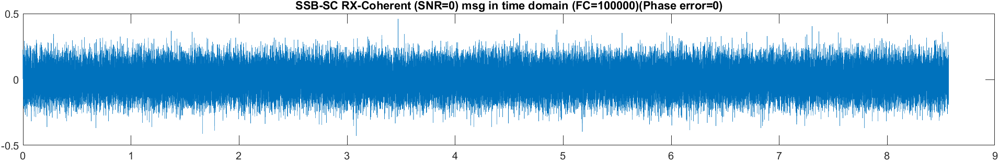

spectrum is so noisy and noise has high power

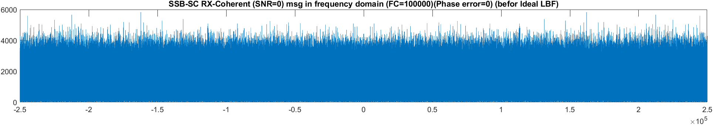

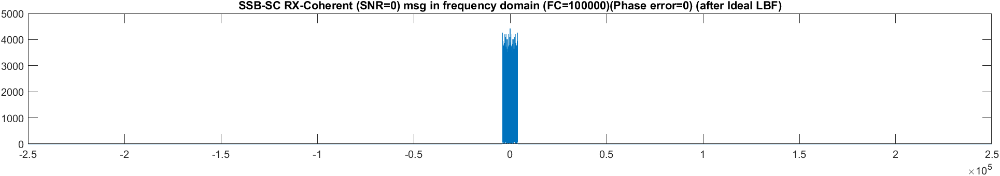

SNR=10, signal is still noisy but less

spectrum is still noisy and noise has high power, but less, also we begin to notice parts of the audio signal

SNR=30, signal is still noisy but less

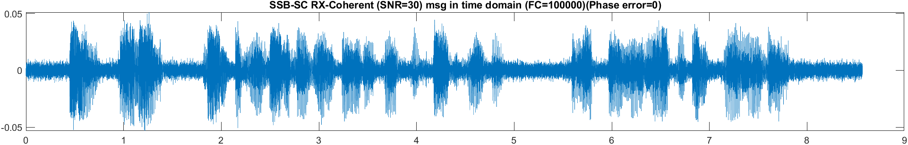

spectrum is still noisy and noise has high power, but less, also we begin to notice parts of the audio signal

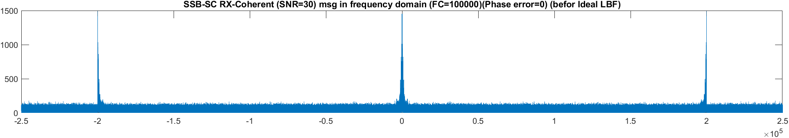

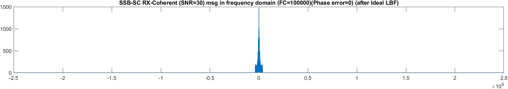

### 9-a) SSB-TC Transmitter

###  

### b) SSB-TC Receiver (Envelope Detector )

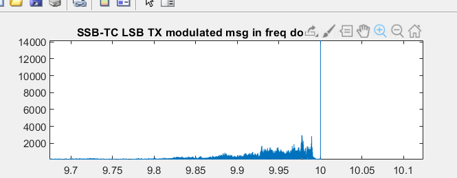

# III– NBFM Part

PLOTS:

1.Massage Filtering:

an ideal pass filter starting from -4000 Hz to 4000 Hz, and each 1 Hz must contain the same sample number as original message. Using a vector representation,

We defined step variable = number of samples divided by (length(y) – 1) and we will use this variable to be a step between frequencies.

Thus, the filter must contain ones in the period between -4000 Hz and 4000 Hz. So, we divided the vector into three regions;

1.  the first region refers to the period before -4000
2.   2-the third period refers to the period after 4000,
3.  the second period refers to the period between -4000:4000

another method for filtering:

% Creating a vector of one’s equal the length of the original signal.

R_F = ones(length(Y),1);

% 1\. Divide the number of samples per sampling frequency

% 2\. Subtract -Fs/2 from -4KHz in order to find the frequency range in which

% you equate the signal with zero.

% 3\. Multiply the frequency range by the result from the division to get

% the number of samples to be equated with zero.

% Filter the signal.

R_F([1:171350 274170:end]) = 0;

Signal = Ys.*R_F;

% Taking the real part only of the signal.

mod_signal = real(ifft(ifftshift(Signal)));

this will give the same as the filter in the code

 Message in Frequency domain after using the Ideal Filter

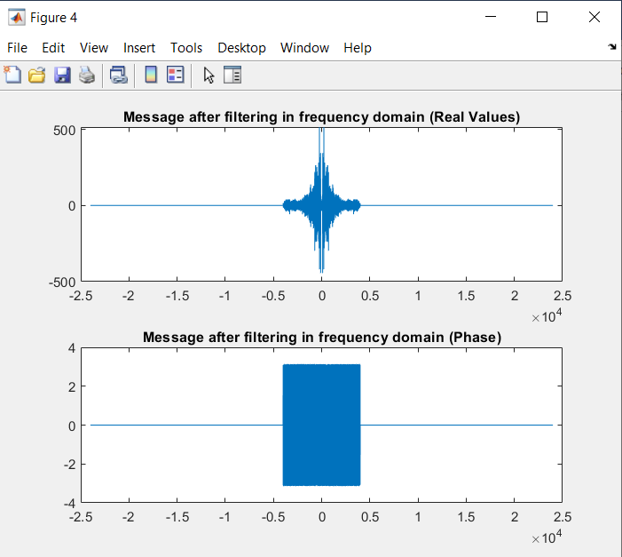

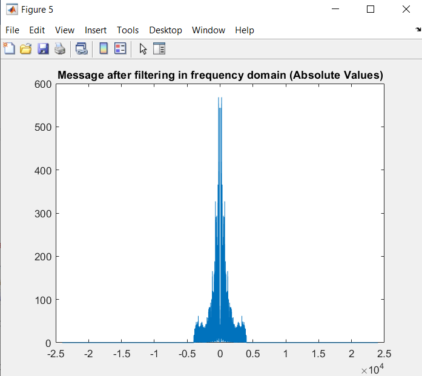

Message signal in Time domain after using the Ideal Filter

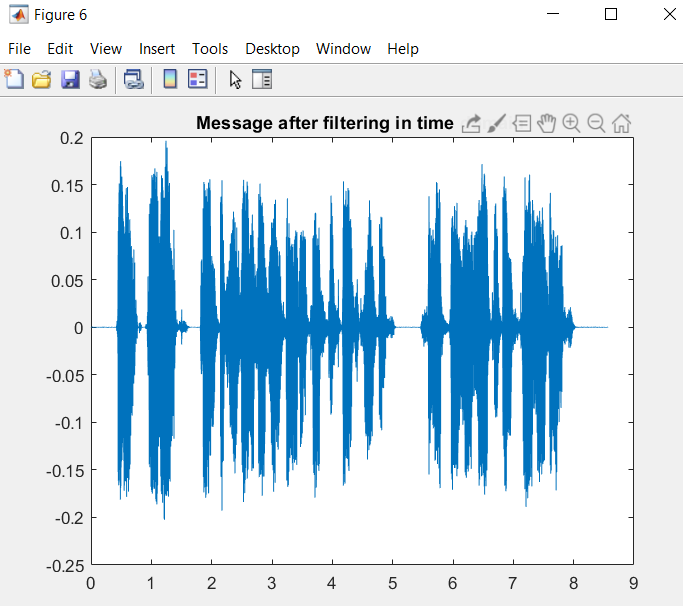

2.Massage NBFM Modulation:

We will use the resample() function, then we will implement the modulated signal equation :

S(t)=Accos(2πfct) − Acsin(2πfct)2πkf∫m(t)dt

Then we will assume: A=10, Kf= 1

We use hilbert() function to produce a phase shift equal -90 to the carrier so we be able to write the term -sin(2πfct) , also we will use cumsum() function to perform the integration.

The resultant plots will be as shown :

NFBM Modulated signal in time domain:

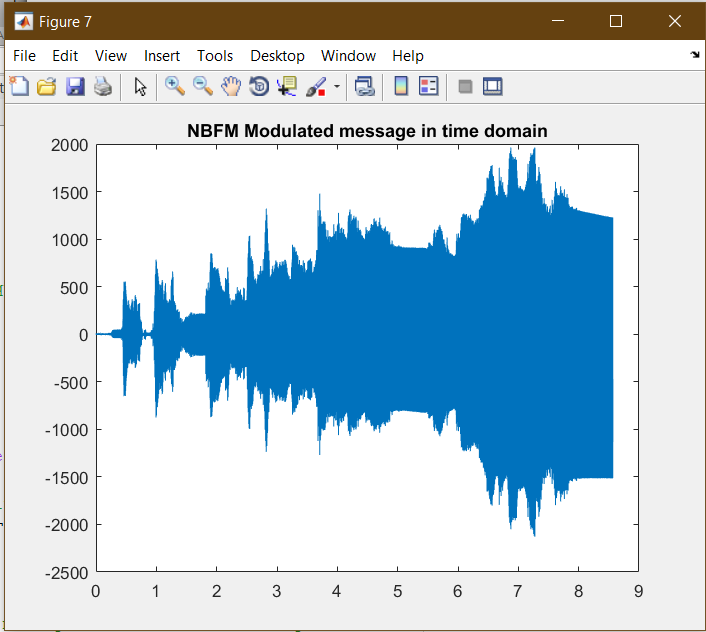

NFBM Modulated signal in frequency domain

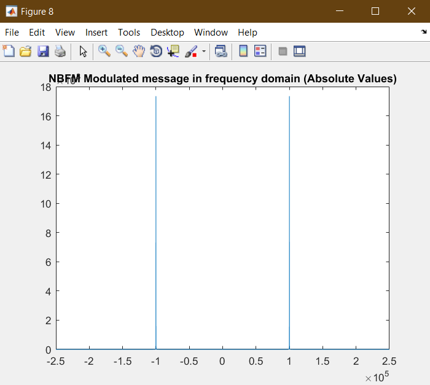

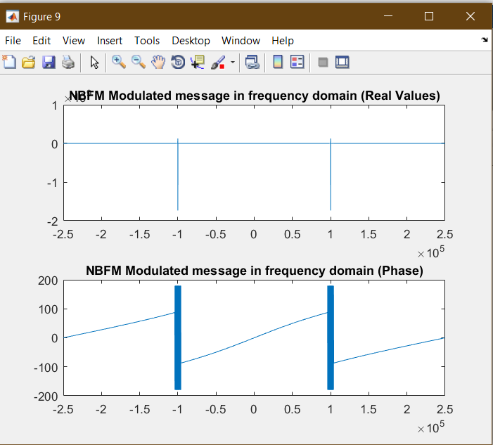

3.Questions on NBFM Modulation :

What can you make out of the resulting plot?

*   The plot is similar to the DSB-Tc’s which means that is not too useful to use.

What is the condition we needed to achieve NBFM?

  1-BW = 2*fm (β + 1), as β must be very small to make the BW ≈2*fm.

  2- Kf must be small.

4\. Massage NBFM Demodulation :

NFBM Demodulated signal in time domain:

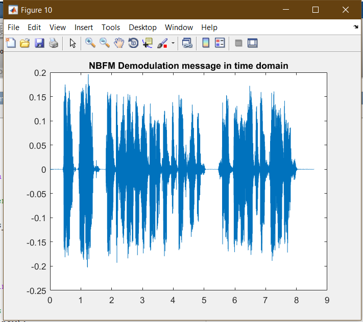

NFBM Demodulated signal in frequency domain:

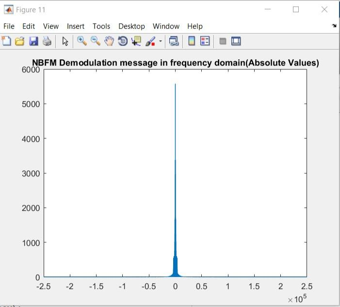

5.Conclusion :

- The output signal of NBFM is same like the original signal but it contains little noise.

- In NBFM, the BW of the modulated signal is equal to 2fm,

this means that the spectrum, modulator, and demodulator are same like DSB-Tc.

